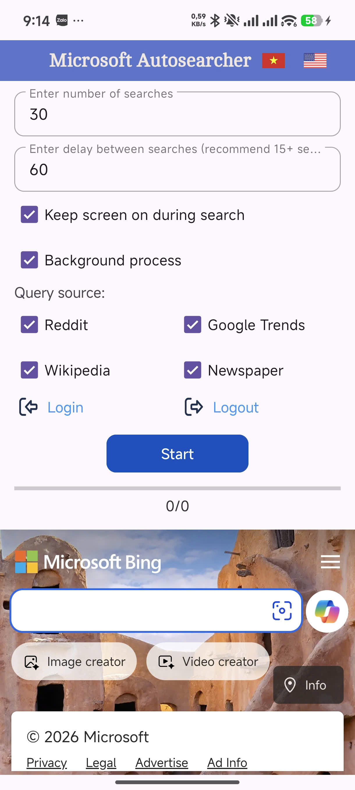
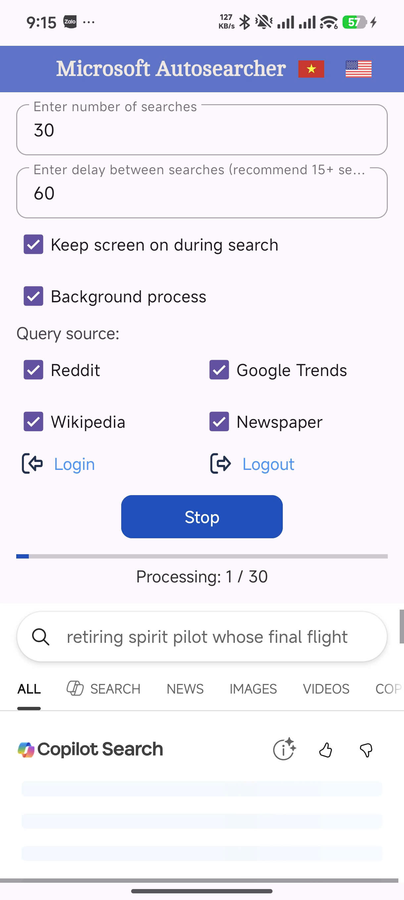

# REWARD AUTOSEARCHER

(Vietnamese | [English](README_en.md))

Reward Autosearcher là một ứng dụng Android được phát triển bằng ngôn ngữ lập trình Kotlin, giúp người dùng tự động hóa quá trình tìm kiếm trên Bing để tích lũy điểm Microsoft Rewards một cách hiệu quả và tiết kiệm thời gian.

## ✨ Tính năng nổi bật

- Tự động tìm kiếm (Auto Search): Thực hiện hàng loạt các truy vấn tìm kiếm tự động mà không cần thao tác thủ công. Có khả năng tự động cuộn giống người thật.

**Đa dạng nguồn từ khóa (Query Sources):**

- Reddit: Tự động lấy tiêu đề bài viết mới nhất từ các subreddit (News, Technology, health,...).
- Local Data: Sử dụng danh sách từ khóa tích hợp sẵn `(queries.json)` với nhiều chủ đề đa dạng.
- Google Trends / Wikipedia: Lấy từ khóa đang thịnh hành trên thế giới (random theo từng quốc gia).
- Newspaper: Lấy từ khóa theo các nguồn báo lớn uy tín trên thế giới với đa dạng các quốc gia.

## Giả lập User-Agent thông minh:

- Tự động gọi API để lấy phiên bản Chrome mới nhất.
- Giả lập User-Agent để tránh bị phát hiện.

## Tùy chỉnh linh hoạt:

- Thiết lập số lượng tìm kiếm mong muốn.
- Cài đặt độ trễ (Delay) giữa các lần tìm kiếm để tránh bị phát hiện spam, mô phỏng quá triình tìm kiếm như người thật.
- Quá trình lấy nguồn tìm kiếm sử dụng ngẫu nhiên User-Agent tránh bị phát hiện.
- Quản lý tài khoản: Tích hợp WebView để đăng nhập và kiểm tra trạng thái tài khoản Microsoft Rewards trực tiếp.
- Tiện ích: Chế độ giữ màn hình luôn sáng (Keep Screen On) khi đang chạy tác vụ, có thể chạy ngầm (Background).
- Có thể cuộn với độ dài và số lần ngẫu nhiên giống như người thật.

## 🛠️ Công nghệ sử dụng

| Công nghệ     | Mô tả                                |
| ------------- | ------------------------------------ |
| Ngôn ngữ      | Kotlin                               |
| Networking    | Retrofit \& OkHttp                   |
| JSON Parsing  | Kotlinx Serialization \& Gson        |
| UI Components | Android Views (XML), Material Design |
| Build System  | Gradle (Kotlin DSL)                  |

## 📷 Screenshot

<p align="center">
  
  
</p>

## 📂 Cấu trúc dự án

**Tệp tin chính:**

- `MainActivity.kt`: Chứa logic chính, xử lý UI và luồng chạy tự động.
- `assets/queries.json`: Kho dữ liệu từ khóa tìm kiếm ngoại tuyến.

**🌳 Cây thư mục của toàn bộ dự án:**

```
├── app
│   ├── src
│   │   ├── androidTest
│   │   │   └── java
│   │   │       └── com
│   │   │           └── tinkismee
│   │   │               └── microsort_reward_autosearcher
│   │   │                   └── ExampleInstrumentedTest.kt
│   │   ├── main
│   │   │   ├── assets
│   │   │   │   └── queries.json
│   │   │   ├── java
│   │   │   │   └── com
│   │   │   │       └── tinkismee
│   │   │   │           └── microsort_reward_autosearcher
│   │   │   │               ├── API_getChromeVersion.kt
│   │   │   │               ├── AutoSearchService.kt
│   │   │   │               ├── MainActivity.kt
│   │   │   │               ├── RetrofitClient_getChromeVersion.kt
│   │   │   │               ├── chromeVersionResponse.kt
│   │   │   │               └── localQueryDataClass.kt
│   │   │   ├── res
│   │   │   │   ├── drawable
│   │   │   │   │   ├── bars.xml
│   │   │   │   │   ├── ic_launcher_background.xml
│   │   │   │   │   ├── ic_launcher_foreground.xml
│   │   │   │   │   ├── login.xml
│   │   │   │   │   ├── logout.xml
│   │   │   │   │   ├── unitedstates.png
│   │   │   │   │   └── vietnam.jpg
│   │   │   │   ├── font
│   │   │   │   │   └── cambo.ttf
│   │   │   │   ├── layout
│   │   │   │   │   └── activity_main.xml
│   │   │   │   ├── menu
│   │   │   │   │   └── navigation_menu.xml
│   │   │   │   ├── mipmap-anydpi
│   │   │   │   │   ├── ic_launcher.xml
│   │   │   │   │   └── ic_launcher_round.xml
│   │   │   │   ├── mipmap-hdpi
│   │   │   │   │   ├── ic_launcher.webp
│   │   │   │   │   └── ic_launcher_round.webp
│   │   │   │   ├── mipmap-mdpi
│   │   │   │   │   ├── ic_launcher.webp
│   │   │   │   │   └── ic_launcher_round.webp
│   │   │   │   ├── mipmap-xhdpi
│   │   │   │   │   ├── ic_launcher.webp
│   │   │   │   │   └── ic_launcher_round.webp
│   │   │   │   ├── mipmap-xxhdpi
│   │   │   │   │   ├── ic_launcher.webp
│   │   │   │   │   └── ic_launcher_round.webp
│   │   │   │   ├── mipmap-xxxhdpi
│   │   │   │   │   ├── ic_launcher.webp
│   │   │   │   │   └── ic_launcher_round.webp
│   │   │   │   ├── values
│   │   │   │   │   ├── colors.xml
│   │   │   │   │   ├── strings.xml
│   │   │   │   │   ├── style.xml
│   │   │   │   │   └── themes.xml
│   │   │   │   ├── values-night
│   │   │   │   │   └── themes.xml
│   │   │   │   ├── values-vi
│   │   │   │   │   └── strings.xml
│   │   │   │   └── xml
│   │   │   │       ├── backup_rules.xml
│   │   │   │       └── data_extraction_rules.xml
│   │   │   └── AndroidManifest.xml
│   │   └── test
│   │       └── java
│   │           └── com
│   │               └── tinkismee
│   │                   └── microsort_reward_autosearcher
│   │                       └── ExampleUnitTest.kt
│   └── proguard-rules.pro
├── gradle
│   ├── wrapper
│   │   ├── gradle-wrapper.jar
│   │   └── gradle-wrapper.properties
│   └── libs.versions.toml
├── .gitignore
├── README.md
├── README_en.md
├── gradle.properties
├── gradlew
├── gradlew.bat
└── settings.gradle.kts
```

## 🚀 Hướng dẫn cài đặt

**Hướng dẫn cài đặt**

- Tải ngay tại release - v1.1.0 - [` Microsoft-Reward-Autosearcher-v1.1.0.apk`](https://github.com/tinkismeeee/Microsoft-Reward-Autosearcher/releases/download/v1.1.0/Microsoft-Reward-Autosearcher-v1.1.0.apk)

### Yêu cầu:

- Điện thoại chạy hệ điều hành Android (Android 9.0 hoặc cao hơn).

### ⚠️ Lưu ý:

- **Ứng dụng được phát triển trên nền Android 11, các phiên bản Android mới hơn có thể sẽ xảy ra lỗi ngoài dự kiến của nhà phát triển.**

## Hướng dẫn sử dụng:

1. Mở ứng dụng **Reward Autosearcher** trên điện thoại.
2. Bấm vào **Login** để đăng nhập (nếu chưa).
3. Nhập số lượng tìm kiếm và độ trễ mong muốn.
4. Chọn source cần sử dụng (Reddit, Google Trends, Wikipedia, Newspaper), có thể để trống tất cả.
5. Nhấn nút **Start** để bắt đầu.

# ⚠️ Lưu ý

Ứng dụng này được phát triển cho mục đích học tập và nghiên cứu về lập trình Android, xử lý mạng (Networking) và tự động hóa tác vụ. Việc sử dụng công cụ tự động có thể vi phạm các điều khoản của [**Microsoft Rewards**](https://www.microsoft.com/vi-vn/servicesagreement?utm_source=copilot.com#13l_MicrosoftRewards). Nếu xảy ra việc tài khoản bị cấm (suspended) hoặc hạn chế tạm thời (restricted), chúng tôi sẽ không chịu trách nhiệm cho các vấn đề xảy ra với tài khoản của bạn.

Để lấy source từ các bài báo (Newspaper) cần có API key. Hiện tại, API key được sử dụng từ nguồn của lập trình viên. Trong các phiên bản sắp tới, người dùng có thể sử dụng API key của chính mình. Số lượng querry trên mỗi API key là 100/ngày cho bản miễn phí. Nguồn: [**News API**](https://newsapi.org/)

# Developed by \[[thaikhang113](https://github.com/thaikhang113)/[Tinkismee](https://github.com/tinkismeeee)]
